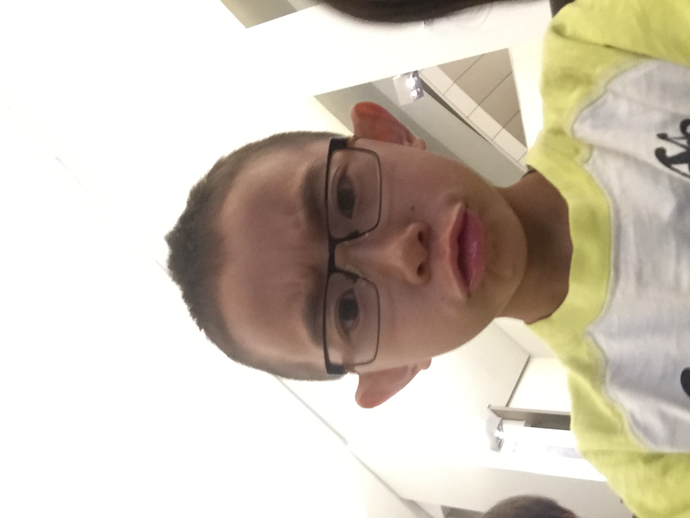
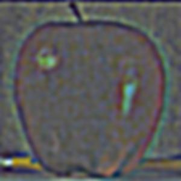
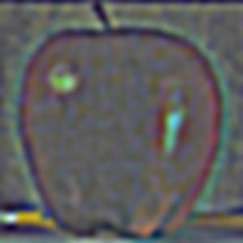
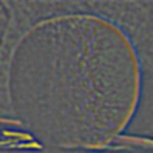
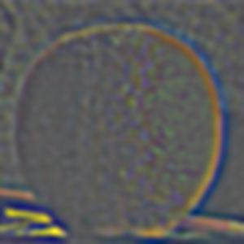

# Project 2: Fun with Filters and Frequencies! :) 

*Follow along with the code here: https://github.com/CamilleDang/proj2

#  Finite Difference Operator

We begin with this original image of a cameraman.

I then defined two finite difference operators D_x and D_y, which I simply made with an np.array of [1, -1] respectively reshaped to a 1 x 2 matrix and 2 x 1 matrix, and convolved the original image with each of the operators (using scipy.signal.convolve2d) to get the x and y partial derivatives of the cameraman image. 

| X Partial Derivative | Y Partial Derivative | 
|:-------------------------:|:-------------------------:|
| |   |

I then computed the gradient magnitude image through np.sqrt(xgrad² + ygrad²) and subsequently normalizing it. To compute the edge image, I binarized the gradient magnitude image, using a threshold of 0.25.

| Combined Gradient Magnitude | Binarized Edge Image | 
|:-------------------------:|:-------------------------:|
|  |   |

# Derivative of Gaussian (DoG) Filter:

## Approach 1: Blurring the Image First

Although convolving with our finite difference operators gets us the correct edge images, it picks up a lot of noise. Using Gaussian filters, we can smooth out these previous results!
I first created a 2D Gaussian kernel using an outer product of two 1D Gaussian filters, using cv2.getGaussianKernel() with a kernel size of 10 and sigma of 2. Convolving the original image with this 2D Gaussian kernel produces a blurrier image, preserving the general shape and structure of the iamge, but just making the edges softer.

I then repeated similar steps as the previous part with the blurred image, convolving the blurred image with the X and Y finite difference operators.

| Blurred X Partial Derivative | Blurred Y Partial Derivative | 
|:-------------------------:|:-------------------------:|
|  |   |

Using the same procedure, we compute the gradient magnitude of this blurred image and subsequently binarized the gradient magnitude image (with a threshold of 0.2) to get the blurred edge image. Compared to the non-blurred image, we can see that both the blurred gradient magnitude image and blurred edge image have much thicker but smoother outlines around the edges. Both these resulting images have less noise compared to the results from the non-blurred images, especially at the bottom of the image, where the grainy noise from the original binarized edge image are completely absent in the blurred binarized edge image.

| Combined Blurred Gradient Magnitude | Binarized Edge Image| 
|:-------------------------:|:-------------------------:|
|  |   |

## Approach 2: DoGx and DoGy

As an alternative approach, instead of first blurring the image with the 2D Gaussian filter and then convolving with the D_x and D_y finite difference operators, we can convolve the 2D Gaussian filter with the D_x and D_y finite difference operators to get the DoG_x and DoG_y, and convolve these with the original image. I then followed the same steps as the above approach to calculate and show the gradient magnitude image as well as the blurred binarized edge image (with the same threshold as the above approach - 0.2), which are identical to the results from the previous approach.

| DoG_x (D_x of 2D Gaussian) | DoG_y (D_y of 2D Gaussian) | 
|:-------------------------:|:-------------------------:|
|  |   |

| Blurred X Partial Derivative | Blurred Y Partial Derivative | 
|:-------------------------:|:-------------------------:|
|  |   |

| Combined Blurred Gradient Magnitude | Binarized Edge Image| 
|:-------------------------:|:-------------------------:|
|  |   |

# Image "Sharpening"!

### Taj Mahal 

We can further use the low-pass Gaussian filter to sharpen blurry images! Given an image, I separated it into the three separate color channels, and then blurred each channel by convolving it with a 2D Gaussian filter. To extract the "details" of the image, I then subtracted each blurred channel by the channel. 

| Blurred Taj Mahal | High Frequency Details of Taj Mahal | 
|:-------------------------:|:-------------------------:|
|  |   |

| Original Taj Mahal | Sharpened Taj Mahal | 
|:-------------------------:|:-------------------------:|
|  |   |

The sharpened image was thus the original channel + the details * alpha. I used alpha = 1.5 to get this sharpened version of the Taj Mahal image. We can clearly see that in the sharpened version, the lines and etches on the Taj Mahal are a lot more defined and sharper, as well as the outline of the building and of the trees. In the original version, the lines are apparent but not as strong.

I tried this sharpening technique on several other images!

### La Sagrada Familia 

| Blurred Sagrada Familia | High Frequency Details of Sagrada Familia | 
|:-------------------------:|:-------------------------:|
|  |   |

| Original Sagrada Familia | Sharpened Sagrada Familia (Threshold = 0.75) | 
|:-------------------------:|:-------------------------:|
|  |    |

This was one of the more successful examples I tried. I sharpened an image of La Sagrada Familia, a famous cathedral in Barcelona (that I actually visited before!). Similarly to the Taj Mahal, it had a lot of intricate lines and detailed edges throughout the building structure, which are much more clearly brought out in the sharpened image. We can also see that details such as the construction cranes, leaves, and trees all stand out more because it is more strongly outlined in the sharpened version.

### Scenery

| Blurred Scenery | High Frequency Details of Scenery | 
|:-------------------------:|:-------------------------:|
|  |   |

| Original Scenery | Sharpened Scenery (Threshold = 1) | 
|:-------------------------:|:-------------------------:|
|  |    |

This scenery also demonstrates a more subtle difference between the sharpened and regular version of this scenery, where the edges of the clouds and mountains are slightly defined. In this example, I think the sharpened image does especially well at outlining the trees at the bottom -- they are much more prominent in the sharpened image as opposed to the original image.

### Trees

| Blurred Trees | High Frequency Details of Trees | 
|:-------------------------:|:-------------------------:|
|  |   |

| Original Trees | Sharpened Trees (Threshold = 1) | 
|:-------------------------:|:-------------------------:|
|  |   |

This image, in celebration of fall, was somewhat not as successful as the other examples. Because this image contained so many edges due to the whole image being leaves of small detail, the sharpening is not as apparent and can be overbearing, given that it is applying sharper edges to a large portion of the image. 

# Hybrid Images

We can also use the low-pass Gaussian filter to hybridize two images! Given an image1 and image2, we first align and resize them. 
Once the images are aligned, we can first blur image1 by convolving it with a 2D Gaussian filter. I personally split the image channelwise, convolved each channel, and then stacked them on top of each other in a helper function called "blur". We can then extract the high frequency details of image2 by first blurring image2 and then subracting the blurred version by the original version (details = image2 - blur(image2). To combine into one hybridized image, we can simply add our blurred image1 and our details of image2.

### Example: Derek + Nutmeg

As an exmaple, here is the hybridized version of Derek (blurred with kernel size: 22, sigma: 7) & his cat Nutmeg (blurred with kernel size: 49, sigma: 8). I first aligned Nutmeg to Derek using their eyes as the points of alignment. I then followed the steps from above, with Derek as image1 and Nutmeg as image2.

| Original Derek | Original Nutmeg | Nutmeg Aligned to Derek |
|:-------------------------:|:-------------------------:|:-------------------------:|
|  |   |  |

| Low Frequency Derek | High Frequency Nutmeg | Derek + Nutmeg! |
|:-------------------------:|:-------------------------:|:-------------------------:|
|  |   |  |

### Example: Little Brother's Eyes

I tried hybridizing two old selfies of my younger brother, one where his eyes are more squinted, and one where his eyes are wider. He shifted a bit between each selfie, so the alignment isn't perfect, but the squinted eyes are image1 (low-frequency, kernel size: 22, sigma; 7) and the widened eyes are image2 (high-frequency, kernel size: 49, sigma: 8). Up close, his eyes look wide open, but taking a few steps back, you'll see his squinting eyes!

| Squinting Connor | Wide Eyed Connor |
|:-------------------------:|:-------------------------:|
|  |   | 

| Low Frequency Squinting | High Frequency Wide Eyes| Squinting + Wide Eyed! |
|:-------------------------:|:-------------------------:|:-------------------------:|
|  |   |  |

### Failed Example: Little Brother Selfies pt. 2

My brother took a lot of selfies, so I tried hybridizing the squinting eyes photo from above with another selfie. Unfortunately, even though I was aligning with the eyes, the angle of the second selfie was too skewed, so the images don't hybridize very well. The outline of the face is completely off and a bit confusing. Although I did end up getting a hybridized image, I consider this a failure since the two images have such different placements of the face and image structure -- since the face takes up so much of both the images, it's difficult to align them and create a successful hybridization.

| Squinting Connor | Other Angle Connor |
|:-------------------------:|:-------------------------:|
|  |   | 

| Low Frequency Squinting | High Frequency Other Angle | Combined |
|:-------------------------:|:-------------------------:|:-------------------------:|
|  |   |  |

### Example: Tim Cruise + Lion

This is famous actor Tim Cruise (low-frequency) hybridized with a lion (high-frequency details). They make quite a good combination!

| Tim Cruise | Lion |
|:-------------------------:|:-------------------------:|
|  |   | 

| Low Frequency Tim | High Frequency Lion | Lion Cruise |
|:-------------------------:|:-------------------------:|:-------------------------:|
|  |   |  |

### Example: Nuggets vs. Eggrolls

This is a hybrid of a plate of chicken nuggets and Vietnamese eggrolls! Both are good snacks, but there is a clear winner. The low-frequency image1 in this example is the chicken nuggets and high-frequency details is the Vietnamese eggrolls 😍. 

| Chicken Nuggets | Eggrolls 🤩 |
|:-------------------------:|:-------------------------:|
|  |   | 

| Low Frequency Nuggets | High Frequency Eggrolls | Nuggets & Eggrolls! |
|:-------------------------:|:-------------------------:|:-------------------------:|
|  |   |  |

This was one of my favorites! We can also look at the frequency analysis of each image, represented by the log magnitude of the Fourier transform of all these images (turned into grayscale).

| Fourier of Nuggets | Fourier of Eggrolls |
|:-------------------------:|:-------------------------:|
|  |   | 

| Low Frequency Nuggets FFT | High Frequency Eggroll FFT | Nuggets & Eggrolls FFT |
|:-------------------------:|:-------------------------:|:-------------------------:|
|  |   |  |

# Gaussian and Laplacian Stacks

We can use a Gaussian stack, in which we repeatedly apply a Gaussian filter to an image and add to the stack, as well as a Laplacian stack, which records the difference between an image in the Gaussian stack and the next (the blurred version). 

Gaussian Stack of Apple
| Level 0 | Level 1 | Level 2 | Level 3 | Level 4 |
|:-------------------------:|:-------------------------:|:-------------------------:|:-------------------------:|:-------------------------:|
|  |   |  |  |  | 

| Low Frequency Nuggets | High Frequency Eggrolls | Nuggets & Eggrolls! |
|:-------------------------:|:-------------------------:|:-------------------------:|
|  |   |  |

Laplacian Stack of Apple
| Level 0 | Level 1 | Level 2 | Level 3 | Level 4 |
|:-------------------------:|:-------------------------:|:-------------------------:|:-------------------------:|:-------------------------:|
|  |   |  |  |  | 

Gaussian Stack of Orange
| Level 0 | Level 1 | Level 2 | Level 3 | Level 4 |
|:-------------------------:|:-------------------------:|:-------------------------:|:-------------------------:|:-------------------------:|
|  |   |  |  |  | 

Laplacian Stack of Orange
| Level 0 | Level 1 | Level 2 | Level 3 | Level 4 |
|:-------------------------:|:-------------------------:|:-------------------------:|:-------------------------:|:-------------------------:|
|  |   |  |  |  | 

# Multiresolution Blending

We can use the above implementation of Laplacian stacks to create a smoothly blended version of two images with a particular mask corresponding to how we want to blend the two images. In this case, we can create a smoothly blended oraple with a vertically split mask. In addition to using the Laplacian stacks of the two images, we use the Gaussian stack of the mask so that for each additional layer of blending, we use a progressively blurrier mask, which improves blending.

For every additional layer that we blend two images, we follow this logic: blended_layer = gauss_mask[i + 1] * laplacian_left[i] + (1 - gauss_mask[i + 1]) * laplacian_right[i].

I used 7 layers of blending and a consistent blurring with kernel size 30 and sigma 7 for each layer. In order to improve blending, in addition to increasing the kernel size and sigma, I also found it really helpful to add an additional layer to the Gaussian stack of the mask, and using gauss_mask[i + 1] for each blended layer. This enabled me not to use the first unblended mask, which made complete blending a bit difficult. With all these adjustments, I was able to obtain a nicely blended oraple!

Oraple
| Original Orange | Original Apple | Mask | Oraple! | 
|:-------------------------:|:-------------------------:|:-------------------------:|:-------------------------:|
|  |   |  |  | 

### Recreating the Process of Blending the Oraple (Figure 3.42 in Szelski)

Recreating the Figure (but flipped).

Apple Contribution to Oraple
| Level 0 | Level 2 | Level 4 | Final |
|:-------------------------:|:-------------------------:|:-------------------------:|:-------------------------:|
|  |   |  |  | 

Orange Contribution to Oraple 
| Level 0 | Level 2 | Level 4 | Final |
|:-------------------------:|:-------------------------:|:-------------------------:|:-------------------------:|
|  |   |  |  | 

Combined Contribution to Oraple
| Level 0 | Level 2 | Level 4 | Final |
|:-------------------------:|:-------------------------:|:-------------------------:|:-------------------------:|
|  |   |  |  | 

## More Blending: Pho + Bun Bo Hue

Two of my favorite Vietnamese soup dishes are often really hard to choose between; if only I could eat them both at the same time! 

Pho + Bun Bo Hue
| Pho | Bun Bo Hue | Mask | Pho + Bun Bo Hue 😁 | 
|:-------------------------:|:-------------------------:|:-------------------------:|:-------------------------:|
|  |   |  |  | 

## Blending w/ Irregular Mask: Kamala in Coconut Tree!

You think you just fell out of a coconut tree? 

Kamala Harris in Coconut Tree
| Mrs. Kamala Harris | Coconut Tree | Mask | 
|:-------------------------:|:-------------------------:|:-------------------------:|
|  |   |  | 

### Kamala in Tree
 

