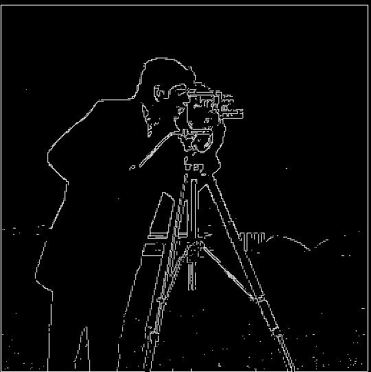

## Project 2: Fun with Filters and Frequencies! :) 

*Follow along with the code here: 

### Overview
This 

###  Finite Difference Operator

We begin with this original image of a cameraman.

I then defined two finite difference operators D_x and D_y, which I simply made with an np.array of [1, -1] respectively reshaped to a 1 x 2 matrix and 2 x 1 matrix, and convolved the original image with each of the operators (using scipy.signal.convolve2d) to get the x and y partial derivatives of the cameraman image. 

| X Partial Derivative | Y Partial Derivative | 
|:-------------------------:|:-------------------------:|
| |   |

I then computed the gradient magnitude image through np.sqrt(xgrad² + ygrad²) and subsequently normalizing it. To compute the edge image, I binarized the gradient magnitude image, using a threshold of 0.25.

| Combined Gradient Magnitude | Binarized Edge Image | 
|:-------------------------:|:-------------------------:|
|  |   |

### Derivative of Gaussian (DoG) Filter:

Although convolving with our finite difference operators gets us the correct edge images, it picks up a lot of noise. Using Gaussian filters, we can smooth out these previous results!
I first created a 2D Gaussian kernel using an outer product of two 1D Gaussian filters, using cv2.getGaussianKernel() with a kernel size of 10 and sigma of 2. Convolving the original image with this 2D Gaussian kernel produces a blurrier image, preserving the general shape and structure of the iamge, but just making the edges softer.

I then repeated similar steps as the previous part with the blurred image, convolving the blurred image with the X and Y finite difference operators.

| Blurred X Partial Derivative | Blurred Y Partial Derivative | 
|:-------------------------:|:-------------------------:|
|  |   |

Using the same procedure, we compute the gradient magnitude of this blurred image and subsequently binarized the gradient magnitude image (with a threshold of 0.06) to get the blurred edge image. Compared to the non-blurred image, we can see that the binarized edge image has 

| Combined Blurred Gradient Magnitude | Binarized Edge Image| 
|:-------------------------:|:-------------------------:|
|  |   |

What differences do you see?
Now we can do the same thing with a single convolution instead of two by creating a derivative of gaussian filters. Convolve the gaussian with D_x and D_y and display the resulting DoG filters as images.

Verify that you get the same result as before.
